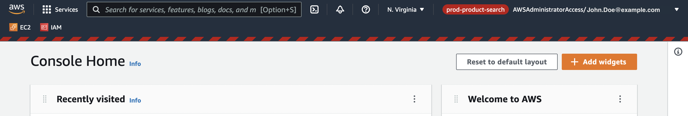

# userscript-aws-visual-account-indicator

## Install
* [Install Violentmonkey](https://violentmonkey.github.io/get-it/) or any other userscript manager
* [Install this userscript](/aws-visual-account-indicator.user.js?raw=1)
* Adjust indicator colors by edit [getDisplayColor](aws-visual-account-indicator.user.js#L23)
